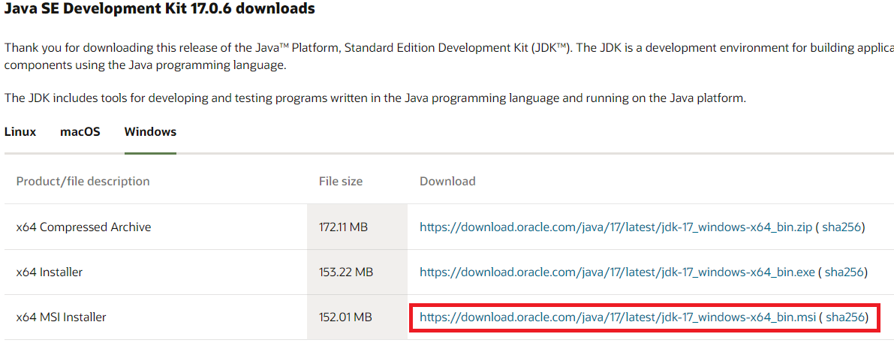
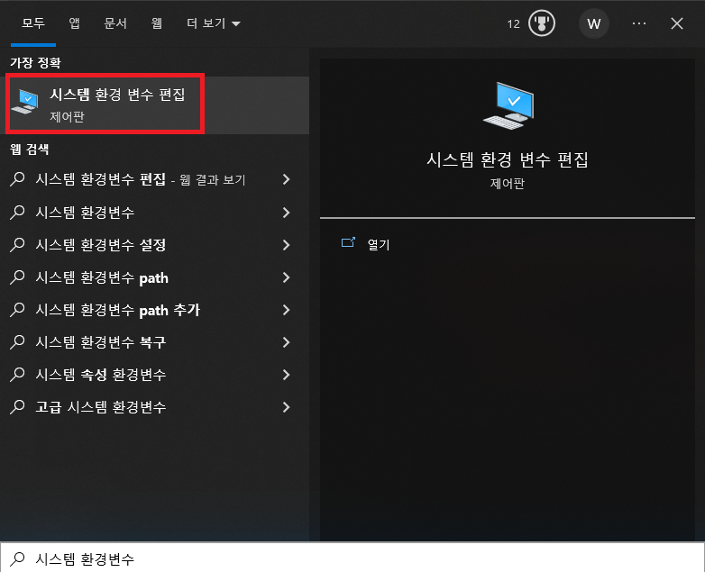
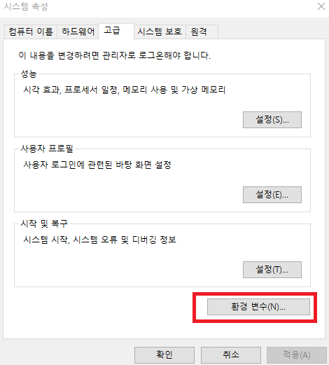
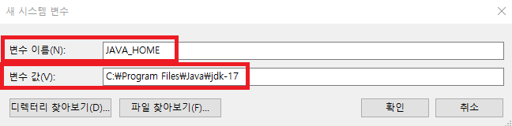

# 한국어 형태소 분석

## KoNLPy 설치

- Java 1.7+ 설치

 * Java를 설치하기 위해  [오라클 홈페이지](https://www.oracle.com/java/technologies/downloads/#jdk17-windows)에 접속하여, 설치파일을 다운로드 한다.



- Java 환경변수를 설정한다. 
 * 시스템 변수







- Java 설치 확인
 * Terminal에서 java -version 을 수행해 본다.

```
java -version


java version "17.0.6" 2023-01-17 LTS
Java(TM) SE Runtime Environment (build 17.0.6+9-LTS-190)
Java HotSpot(TM) 64-Bit Server VM (build 17.0.6+9-LTS-190, mixed mode, sharing)
```

```
apt-get install g++ openjdk-8-jdk
```

- KoNLPy 패키지 설치

```
pip install konlpy jpype1
```

- KoNLPy 설치 테스트
 * 혹 오류가 난다면, VScode 를 재시작

 ```
from konlpy.tag import Okt
okt = Okt()
malist = okt.pos("아버지 가방에 들어가신다.", norm=True, stem=True)
print(malist)
 ```


## 형태소 분석을 기반으로 한 단어 출현 빈도 구하기


